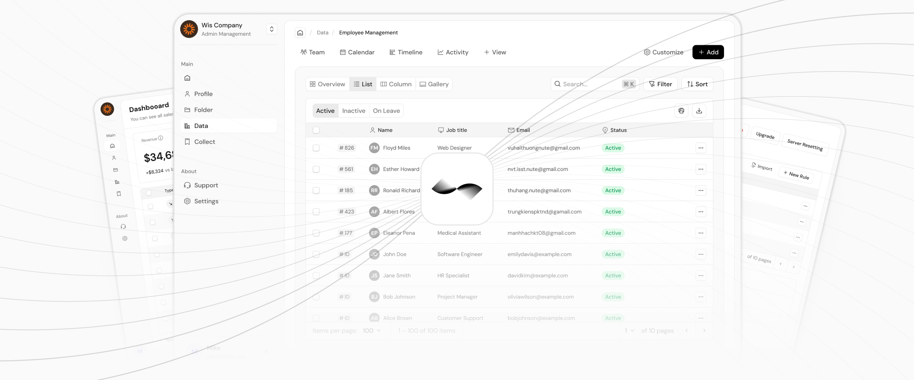

  

<h1 align="center">
  Wis Design System
</h1>

Wis 是 [Wis.design](https://wis.design) 推出的开源设计系统，致力于为 B 端产品提供卓越的多设备用户体验

>所有组件均支持 **PC** 与 **Mobile** 双端，属性与功能保持一致，用户体验经过系统性设计和验证

系统基于“本质驱动”的设计语言，提供可运行的代码组件、设计工具与产品设计指南，帮助团队更高效地构建统一、可扩展的界面

  

🌐 [English](./README.md) | [中文](./README.zh-CN.md)

## 开始使用
如果你刚开始使用，非常推荐你查看我们的[快速上手指南](https://wis.design/getting-started/quick-start)

你可以在这里找到我们的所有资源包的列表

| 包名      | 描述 |
| :------- | :----------- |
| [wis](https://github.com/wisdesignsystem/wis) | 提供一套针对B端产品的多设备UI组件库 |
| [wiscore](https://github.com/wisdesignsystem/wis-cli/tree/main/packages/core/README.zh-CN.md) | 提供运行时核心工具能力，比如路由，微前端等 |
| [@wisdesign/wis-plugin](https://github.com/wisdesignsystem/wis-cli/tree/main/packages/wis-plugin/README.zh-CN.md) | 该插主要职责是以插件的形式去对接社区的开源构建方案，提供基础工程化能力 |
| [@wisdesign/cli](https://github.com/wisdesignsystem/wis-cli/tree/main/packages/cli/README.zh-CN.md) | 统一管理设计和研发过程涉及的工具库 |
| [@wisdesign/lsicon](https://github.com/wisdesignsystem/lsicon) | 优雅的开源图标库 |
| [@wisdesign/lsicon-figma](https://github.com/wisdesignsystem/lsicon-figma) | 通过Figma插件管理你的图标库 |

## 文档
请在我们的[文档网站](https://wis.design/getting-started/quick-start)查看完整的操作指南 

## 贡献
我们是一群热爱开源的设计师与开发者，期待与你一起构建一个充满活力的贡献者社区。

我们一直在寻找设计师、工程师来帮助我们修复错误、构建新组件、书写项目文档，如果你感兴趣，请查看我们的[贡献指南](https://wis.design/community/contribution)

## 许可证
本库采用 MIT 许可证授权